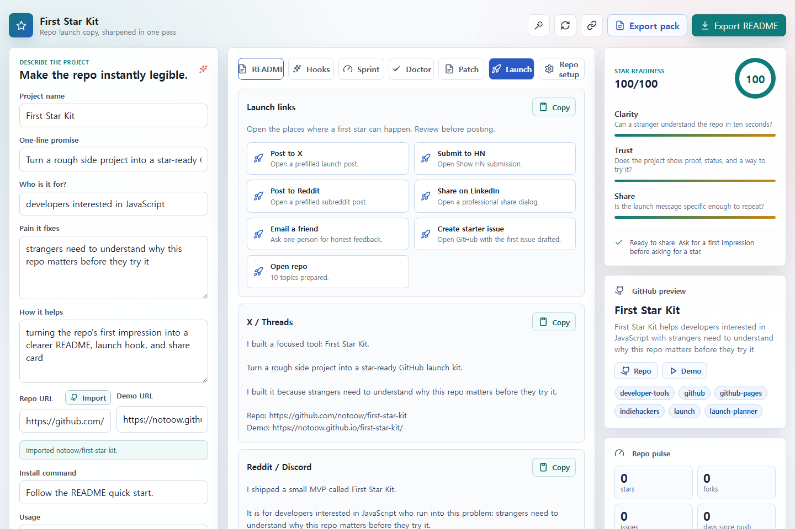

# First Star Kit

> Turn a rough side project into a star-ready GitHub launch kit.

First Star Kit helps developers turn a half-polished repo idea into the pieces people actually see first: README copy, GitHub metadata, starter issues, and launch posts.

Live demo: https://notoow.github.io/first-star-kit/



## Why

Getting a first GitHub star is often less about the code and more about whether a stranger can understand the project quickly. This app gives you one quiet workspace for sharpening that first impression before you share the repo.

## Features

- Live README generator
- Public GitHub repo import for name, description, topics, homepage, license, and quick-start hints
- Repo Pulse for stars, forks, issue count, recent activity, README, license, homepage, and topics
- README Doctor for first-impression gaps and exact fixes
- Drop-in README patches for hero copy, quick start, why section, starter issue, and feedback ask
- Launch links for X, Hacker News, Reddit, LinkedIn, email, GitHub starter issue, and repo
- Shareable kit links that restore the filled workspace from the URL
- One-file Markdown launch pack export
- Copy-ready hooks for posts, DMs, and first-impression asks
- 30-minute first-star sprint plan
- GitHub repo name, description, topics, and starter issues
- Launch copy for X, Reddit, Hacker News, Discord, and friendly DMs
- Star-readiness scoring for clarity, trust, and shareability
- Shareable 1200x630 launch card PNG export
- Local autosave and Markdown export
- No build step, no API key, no tracking

## Quick Start

Open `index.html` in a browser.

## Good Fit

- Shipping a tiny open-source app this week
- Preparing a repo before posting it in a community
- Rewriting a README that explains the code, but not the value
- Asking one friend for a fast first-impression check
- Making a small launch image without opening a design tool

## Suggested Repo Metadata

Description:

```text
Turn a rough side project into a star-ready GitHub launch kit.
```

Topics:

```text
github, readme, launch, open-source, developer-tools, marketing
```

## License

MIT
